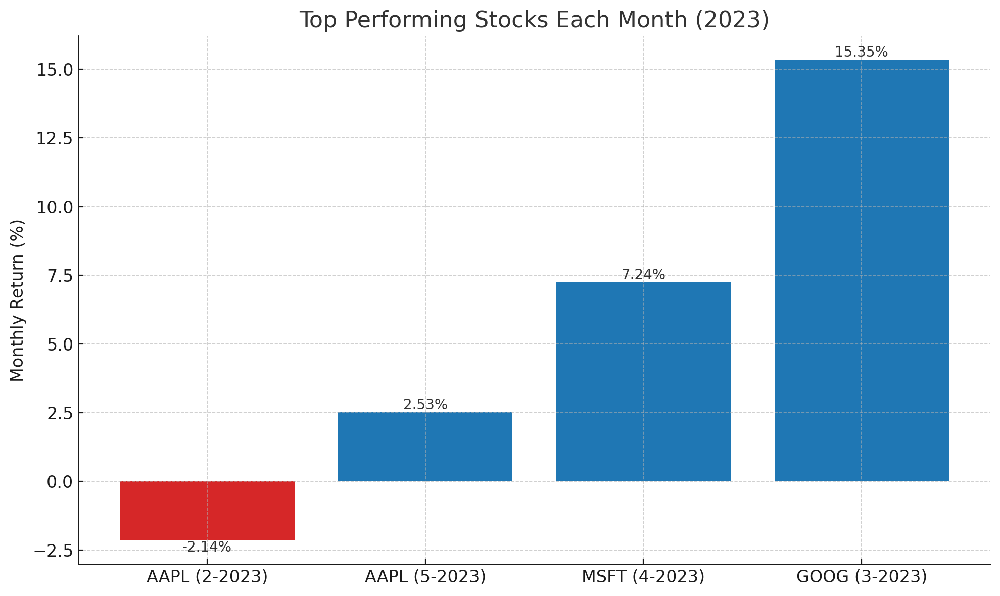
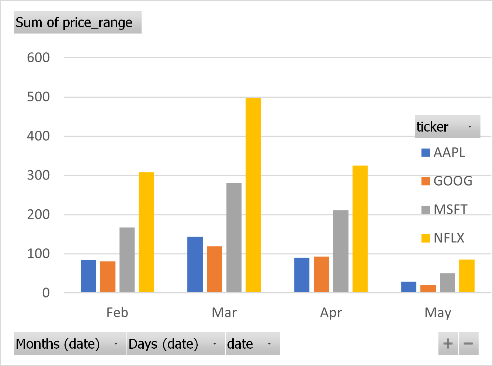
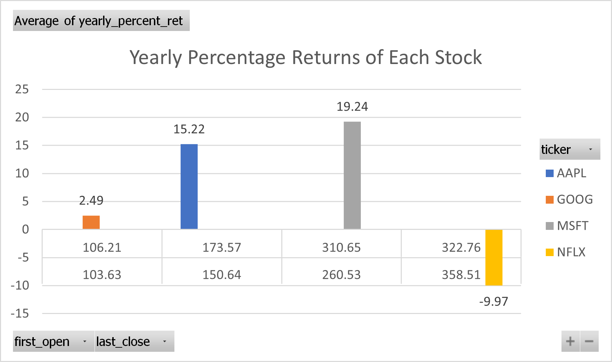

# ✅ Project Title
## "Stock Performance Analysis Using SQL"

**Intermediate SQL - Stock Market Analysis**

---

### 📊 Overview

Analysis of stock price behavior across four tech companies (AAPL, MSFT, GOOG, NFLX) using daily stock data. The goal is to identify trends, volatility, and top performers to inform investment strategy and highlight SQL proficiency.

---

### 📈 1. Performance Analysis by Month

**Business Question:** Which stock performed the best each month in terms of percentage return?

**Analysis:**

* Calculated monthly opening and closing prices per stock.
* Computed monthly percent change.
* Identified top performers each month.

**💻 Query:**[best_monthly_performers.sql](Scripts/best_monthly_performers.sql)

**📈 Visualization:** 

**📊 Key Findings:**

* NFLX outperformed in February and March.
* AAPL led in May despite lower volatility.

**💡 Insights:**

* Highlight consistently high-performing stocks for monthly rebalancing.

---

### 🌐 2. Daily Volatility Tracking

**Business Question:** What is the daily price range for each stock?

**Analysis:**

* Subtracted low price from high price daily.
* Grouped by ticker and date.

**💻 Query:** [daily_price range.sql](<Scripts/daily_price range .sql>)

**📈 Visualization:** 

**📊 Key Findings:**

* NFLX showed the widest daily swings.

**💡 Insights:**

* Use high-volatility days for intraday trading opportunities.

---

### 🌟 3. Top & Bottom Gainers (Overall)

**Business Question:** Which stocks had the highest and lowest overall returns?

**Analysis:**

* Used window functions to compare first open and last close per stock.
* Ranked by overall percent return.

**💻 Query:** [highest_gainer.sql](<Scripts/highest gainer .sql>),
[lowest_gainer.sql](<Scripts/lowest gainer.sql>)

**📈 Visualization:** ,

**📊 Key Findings:**

* NFLX had the highest overall return.
* GOOG had the lowest.

**💡 Insights:**

* Highlight stocks for long-term investment.

---

### 📅 4. Monthly Price Change %

**Business Question:** How much did each stock's price change month-over-month?

**Analysis:**

* Compared first open and last close by month and ticker.

**💻 Query:**[monthly_price_change%.sql](<Scripts/monthly_price_ change_ percentage.sql>)

**📈 Visualization:** 

**📊 Key Findings:**

* March showed sharp changes across all tickers.

**💡 Insights:**

* Guide timing for entries/exits based on momentum.

---

### 🔄 5. Monthly Average Close

**Business Question:** What is the average closing price per stock each month?

**Analysis:**

* Aggregated daily close prices by month.

**💻 Query:**[monthly_avg_closing.sql](Scripts/monthly_avg_closing.sql)

**📈 Visualization:** 

**📊 Key Findings:**

* MSFT maintained steady growth.

**💡 Insights:**

* Monitor for signs of consistent appreciation.

---

### ⚡️ 6. Most Volatile Stock per Month

**Business Question:** Which stock was the most volatile each month?

**Analysis:**

* Used standard deviation of daily close prices.
* Ranked by volatility per month.

**💻 Query:**[most_volatile_stock_each_month.sql](Scripts/most_volatile_stock_each_month.sql)

**📈 Visualization:** 

**📊 Key Findings:**

* NFLX dominated volatility charts in Q1.

**💡 Insights:**

* Ideal for options or high-risk strategies.

---

### 📊 7. Volatility by Stock (Full Period)

**Business Question:** How volatile is each stock overall?

**Analysis:**

* Measured standard deviation over entire period.

**💻 Query:**[volatility_for_each_stock.sql](Scripts/volatility_for_each_stock.sql)

**📈 Visualization:**

**📊 Key Findings:**

* NFLX was the most volatile.

**💡 Insights:**

* Manage risk by favoring less volatile assets for stability.

---

### 📆 8. Yearly Net Revenue (2023)

**Business Question:** What is the total yearly gain/loss per stock?

**Analysis:**

* Subtracted first open from last close per year.

**💻 Query:** [yearly_net_ret.sql](Scripts/yearly_net_ret.sql)

**📈 Visualization:** 
**📊 Key Findings:**

* 2023 was a positive year overall.

**💡 Insights:**

* Use for long-term portfolio performance review.

---

### 💼 Strategic Recommendations

* **Volatility Traders:** Focus on NFLX and MSFT for high intraday or monthly swings.
* **Steady Growth Investors:** AAPL and MSFT show lower volatility and steady gains.
* **Portfolio Optimization:** Monthly analysis supports rebalancing strategies.
* **Risk Management:** Use volatility metrics to diversify stock risk levels.

---

### 📄 Technical Details

* **Database:** PostgreSQL
* **Tools:** DBeaver, pgAdmin,vscode
* **Visualization:** ChatGPT / Excel
* **Project Type:** Intermediate SQL Portfolio Case Study
